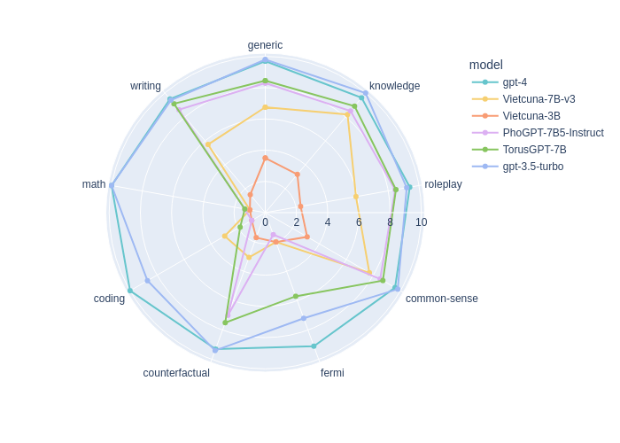

# Torus GPT: Vietnamese open source Generative Pre-training model
**Author**: **Duy Quang Do<sup>1</sup>**, **Hoang Le<sup>1</sup>** and **Duc Thang Nguyen<sup>2</sup>**<br>
<sup>1</sup>*Taureau AI, Hanoi, Vietnam*<br>
<sup>2</sup>*Torus AI, Toulouse, France*


Torus GPT model is an open-source, multi-turn, large language model (LLM) specifically designed for the Vietnamese language. Trained on an extensive and diverse Vietnamese dataset, TorusGPT strives to deliver superior understanding and representation of the Vietnamese language. What sets it apart is its distinct advantages over other LLMs, in terms of speed, performance, and commercial applicability.

This release includes model weights, inference code, evaluation result for 7B (7-billion parameters) version.

- [Introduction](#introduction)
- [Model weights](#model-weights)
- [Technical overview](#technical-overview)
- [Evaluations](#evaluations)
- [Disclaimer](#disclaimer)
- [Acknowledgement](#acknowledgement)

## Introduction

Torus Actions SAS (a.k.a. Torus AI) was founded in 2019 by a group of scientists led by Professor Nguyen Tien Zung who discovered the toric conservation principle:
```
Everything conserved by a dynamical system is also conserved by its associated torus actions.
```
Torus' mission is to create augmented intelligence solutions for the well-being of millions of people worldwide.

Torus GPT is the latest initiative aimed at enhancing the language model in Vietnam for researchers and end-to-end users. The model is designed with the goal of ensuring ease of deployment and functionality, while also maintaining an open license. Our objective is to foster an active community that collaborates on solving real-life problems, contributing to the advancement of AI development in Vietnam.

## Model weights

Our lastest weights for Torus GPT release can be found here:

| Date  | Version | Huggingface Repo | Context Length |
| ------------- | ------------- |------------- |------------- |
| 19/12/2023  | ```TorusGPT-7B-1.0```  |[TorusGPT1.0](https://huggingface.co/allbyai/torusgpt-7b-v1.0) | 2048 |


## Technical overview

The pre-trained model is based on LLAMA 2 which fine-tuned on large raw dataset by bkai-foundation-labs [Vietnamese-LLAMA2](https://huggingface.co/bkai-foundation-models/vietnamese-llama2-7b-40GB).

The fine-tuned model Torus GPT is trained on 430k of high-quality, multi-turn conversation data, included both data from open-source and our in-house data ensuring the quality of chat model and the Vietnamese structural understanding capability of the model. Some of the open-source data are [UIT-ViQUAD](https://paperswithcode.com/dataset/uit-viquad), [Bactrian-X](https://huggingface.co/datasets/MBZUAI/Bactrian-X), [Grade-school-math](https://github.com/openai/grade-school-math),... Other data contains our custom conversation data, multiple-topic data.

Torus GPT have some major main advantages compared to other's model:

- It's fully open source with [LLAMA 2 LICENSE](https://github.com/facebookresearch/llama)
- It's enhance huge better speed by the Vietnamese Tokenizer (Which about 1/4 less token in an Vietnamese sentence compared to ChatGPT and LLAMA), and the small model size
- The comparison result is a lot better compared to current open-source model
- The deployment method is easy, you can create an conversational chatbot within a few step.

With Torus GPT, we hope to push the state of current AI technology huge step forward for Vietnam and Vietnamese people.

## Evaluations

Thank to the effort of [PhoGPT team](https://github.com/VinAIResearch/PhoGPT), we use the Vicuna translated benchmark question [HERE](https://docs.google.com/spreadsheets/d/122ldeXuBmLSFFqaFbflj82VyYTKL-Qc2hZiTI9csc-Q/edit#gid=44668470) with our benchmark results on **Torus GPT**, and compared them by the [Fastchat MT-bench method](https://github.com/lm-sys/FastChat/tree/main/fastchat/llm_judge). The result bellow shows that **Torus GPT** has a competitive performance compared to current State-of-the-art like ChatGPT.

The benchmark used is the fastchat benchmark method, thus model like **URA-LLaMa-7B** and  **URA-LLaMa-13B** has a big advantages, since they generate a lot of English answer which is not concern as an shortcoming because of the evaluation prompt of Fastchat. In realistic, they may have much more lower score, since we are benchmarking on Vietnamese languages.

The average result shown in the table bellow:

Ranking | model          | Result   |
| ------------- | ------------- | ------------- |
1|gpt-4          |      9.52500 |
2|gpt-3.5-turbo         |     9.23750   |
3|**TorusGPT 7B**         |    7.31875   |
4|URA-LLaMa-13B*     |   6.98750   |
5|PhoGPT-7B5-Instruct|  6.49375   |
6|Vietcuna-7B-v3      | 5.21250   |
7|URA-LLaMa-7B*       |  3.58750   |
8|Vietcuna-3B        |  2.28750   |

*: *URA's model real score must be much lower in the respect to Vietnamese answer quality evaluation*

The details of benchmark in term of subject is shown in the figure bellow (we do not display URA-LLaMa because they generate half of answer in english):



**TorusGPT 7B** perform very good at qualitative task compared to other model, especially have the ability to write and answer almost like gpt-3.5-turbo model. However, in quantitative tasks like coding and mathematics, the TorusGPT model is not good due to lacks of data in the training phase. This evaluation result suggest the further development of increase the ability of model in STEM task.

To run the evaluation code again, please refer to [Fastchat MT-bench method](https://github.com/lm-sys/FastChat/tree/main/fastchat/llm_judge). We included the answer of each model, the prompt, and the evaluation result [HERE](https://huggingface.co/allbyai/torusgpt-7b-v1.0/tree/main/mt_bench) for re-produce. The generated result can be also obtained [HERE](https://docs.google.com/spreadsheets/d/1S1UmfImrLKFtxRmdX6B5plnIIyh3RiOr/edit?usp=sharing&ouid=102198682273617686649&rtpof=true&sd=true) for human evaluation.

## Run the model

The prompt of Torus LLM is same with Vicuna, take the advantages of multi-turn, high-speed, token-effective conversation. The example prompt describe bellow.

```
Cuộc hội thoại giữa người dùng và một trí thông minh nhân tạo. Đưa ra câu trả lời chính xác, giúp ích cho người dùng.

USER: Xin chào!
ASSISTANT: Xin chào!</s>
USER: Bạn khỏe chứ?
ASSISTANT: Tôi khỏe, cảm ơn.</s>
```

You can use that template to run the model by Huggingface transformer. The inference code is in the file [inference_hf.py](inference_hf.py). You can run it by:

```
python inference_hf.py
```

## Deployment

Torus GPT can be easy to deploy using Fastchat.

Step 1: Install fastchat
```
pip3 install "fschat[model_worker,webui]"
```

Step 2: Run the RESTful API Server

Run the controller:
```
python3 -m fastchat.serve.controller
```

Run the model worker:
```
python3 -m fastchat.serve.model_worker --model-path path-to-TorusGPT --conv-template vicuna_v1.1
```

Launch the RESTful API server:
```
python3 -m fastchat.serve.openai_api_server --host localhost --port 8000
```

Run the example streamlit code:
```
streamlit run demo.py
```

## Disclaimer

This project is built upon Meta's Llama-2 model. It is essential to strictly adhere to the open-source license agreement of Llama-2 when using this model. If you incorporate third-party code, please ensure compliance with the relevant open-source license agreements. It's important to note that the content generated by the model may be influenced by various factors, such as calculation methods, random elements, and potential inaccuracies in quantification. Consequently, this project does not offer any guarantees regarding the accuracy of the model's outputs, and it disclaims any responsibility for consequences resulting from the use of the model's resources and its output. For those employing the models from this project for commercial purposes, developers must adhere to local laws and regulations to ensure the compliance of the model's output content. This project is not accountable for any products or services derived from such usage.

## Acknowledgement

We would like to thank to [bkai-foundation-labs](https://huggingface.co/bkai-foundation-models/vietnamese-llama2-7b-40GB), [phogpt](https://github.com/VinAIResearch/PhoGPT), and [fastchat](https://github.com/lm-sys/FastChat/tree/main) for some references of our work.

Please cite our work if you find the Torus GPT helpful.

```
@software{

}
```
